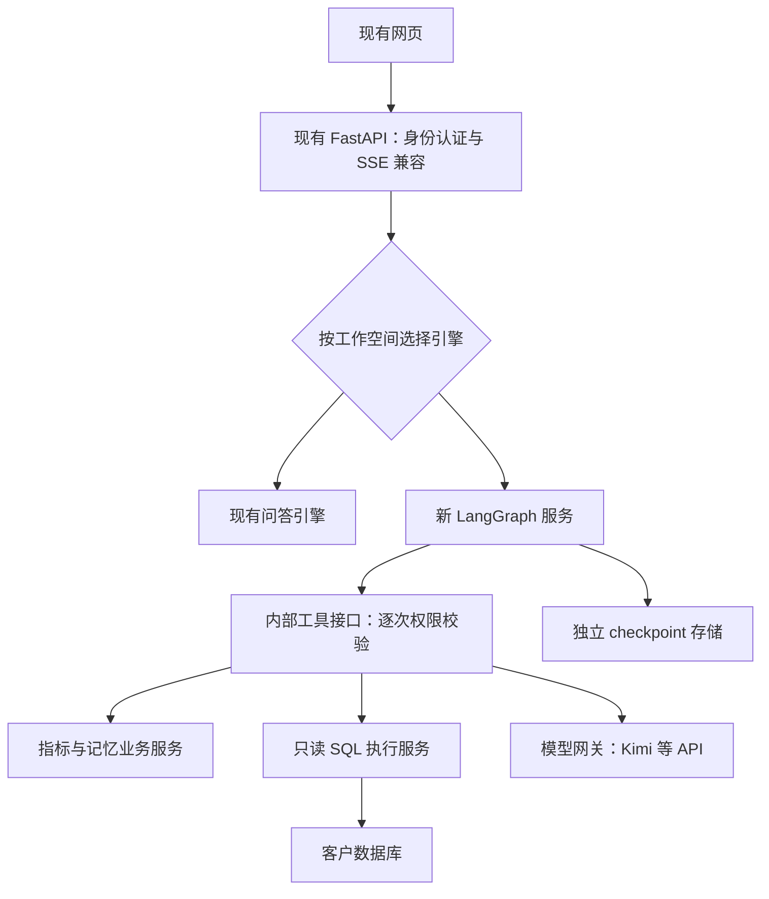
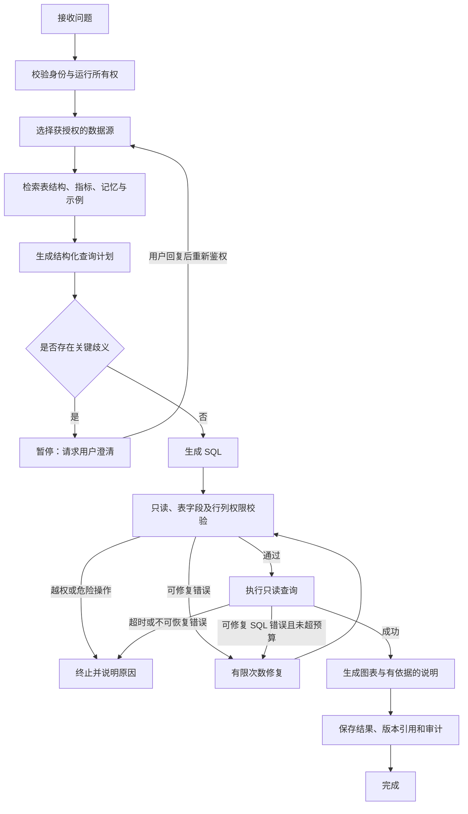

# AdaptiveBI LangGraph 迁移方案

日期：2026-09-17。状态：方案已落库，图引擎尚未实施。

## 1. 范围与基线

复制基线为我们自己的 Levywiseco/SQLBot-Adaptive，提交 `55df5be1fb8bef1b2d912e545fecf4f484565d38`，包含同事 sqlbot-ice 的 5 次提交和集成修复。
本方案根据该版本的代码和 LangGraph 官方文档制定；不使用 SQLBot 原始仓库、官网教程或原始产品材料作为新设计依据，也不配置该原始仓库为 upstream。
复制保留代码历史和随代码附带的许可证、版权声明。仓库复制不等于独立重写，不能据此宣称已消除原有代码来源。
仅复制 Git 跟踪的代码和文档，不复制本机 .env、数据库、运行日志、依赖目录或 API 密钥。

目标：将集中式问答流程迁移为可观测、可恢复、可限制重试、可暂停澄清的状态图，同时保留当前指标库、记忆库、反馈治理、权限、审计及前端体验。

非本轮目标：重写全部 UI、更换业务数据库、训练基础模型、自动修改客户数据库、同时迁移所有第三方模型适配器。

## 2. 当前代码证据

| 位置 | 当前情况 | 迁移动作 |
| --- | --- | --- |
| backend/pyproject.toml | 声明 langchain 0.3 系列及 langgraph >=0.3,<0.4 | 旧环境暂不升级；新编排服务独立锁定依赖 |
| backend/apps/chat/task/llm.py | 约 2,000 行；run_task 顺序组织检索、生成、校验、执行、图表及 SSE | 拆节点及服务接口，不将整个 run_task 包成一个节点 |
| backend/apps/chat/api/chat.py | 问答、重生成、分析等入口返回流式结果 | 增加运行引擎路由和事件兼容层 |
| backend/apps/ai_model/model_factory.py | 使用 LangChain 模型封装，包含多种模型适配 | 第一阶段通过模型网关复用；第二阶段可替换底层 SDK |
| backend/apps/metrics | 指标版本、发布与检索能力 | 作为独立业务服务调用，保留版本引用 |
| backend/apps/memory | 记忆权限、检索与指标上下文 | 分离短期 checkpoint 和长期业务记忆 |
| backend/apps/learning、feedback | 候选、审批、拒绝、撤销及反馈 | 形成独立学习流程，不能直接自动发布共享规则 |
| evaluations、tests | 已有评估样例及回归测试 | 冻结基线、补充图执行和隔离用例 |

代码检索发现 langgraph 出现在依赖声明中，当前业务 Python 文件没有 StateGraph 编排实现。迁移工作的核心是流程重构，而非改一个 import。

## 3. 技术选择

采用“现有 API + 独立 LangGraph 编排服务 + 明确的业务工具接口”。最初仍可部署在同一台服务器，用两个进程/容器；不要求新增服务器或 Kubernetes。

独立服务的原因是隔离现有 LangChain 0.3 依赖与新 LangGraph 的依赖解析、运行状态和故障。代价是一次内部通信及部署管理，需要超时、认证和链路 ID。

LangGraph 负责有状态的执行流程；模型 API 调用、SQL 权限、指标定义和学习效果仍由我们实现。LangGraph 可以不使用 LangChain 高层模型封装，但这不意味着其底层依赖树完全不存在 langchain-core。[官方概述](https://docs.langchain.com/oss/python/langgraph/overview)

新服务在实施时选择并锁定经过验证的 LangGraph、PostgreSQL checkpoint 适配器及 Python 版本，提交独立锁文件。不要直接把最新示例套到旧 0.3 环境，也不要把无上限的 pip install -U 作为生产升级方式。



新服务不连接生产元数据库做初始化。开发使用独立数据库和合成数据；生产切换另行执行升级流程。

## 4. 问答状态图



- 默认最多 2 次修复，另设模型调用次数、总 token、总耗时和递归上限；数值为起始配置，按评测调优。
- 网络短暂失败使用有界退避；鉴权失败不能通过换提示词绕过。
- 修复后的 SQL 必须再次完整校验。数据源在执行时重新检查权限，不相信模型给出的表名列表。
- 缺少关键指标口径时先澄清；低可信度不能只依靠模型自行打分，应依据指标匹配、字段覆盖和验证结果。
- 图表生成失败可降级为表格；查询结果为空不等于执行失败。
- 分析、预测、推荐问题、嵌入式问答及 MCP 入口分别迁移，未达功能等价前继续走旧引擎。

## 5. 状态、接口与存储契约

状态建议字段：schema_version、graph_version、run_id、chat_id、record_id、question、datasource_id、metric_version_refs、memory_refs、query_plan、sql、validation_result、attempts、token_usage、deadline、result_ref、status、safe_error。

身份由 API 从登录会话生成并传入受信任的运行上下文，不接受客户端自报 user_id/oid。checkpoint 中仅保存可验证的身份引用，恢复执行必须重新鉴权。

不把数据库连接、ORM Session、API Key 或完整查询结果写入图状态。结果单独存储并设置权限和保留期，checkpoint 只保存引用与必要摘要。长期记忆继续使用现有业务表，不把所有历史聊天原样累计进提示词。

工具接口至少包含：

| 工具 | 输入与职责 |
| --- | --- |
| list_allowed_datasources | 受信任的用户/工作空间上下文，返回允许访问的数据源 |
| get_schema_context | 数据源及问题，返回权限过滤后的表字段 |
| retrieve_metrics / retrieve_memories | 返回内容、版本、来源和适用范围 |
| generate_model_output | 模型配置引用与提示词；密钥由模型网关读取 |
| validate_sql / execute_readonly_sql | 解析 SQL，重检权限、超时、行数和只读账户 |
| save_answer / record_feedback | 按运行 ID 幂等落库 |

工具 HTTP 接口仅内部开放，使用服务身份加短期委托凭据，绑定用户、工作空间、run_id、有效期和用途；业务侧再次校验权限。禁止仅凭可伪造的 HTTP 头信任 oid。

运行接口拟定：创建 run、读取 run 状态、订阅事件、提交澄清回复、取消 run。取消必须传递至模型/SQL 调用；不能取消的数据库驱动任务要明确记录其后台执行状态。

每个会话串行接受生成任务，使用锁或乐观版本控制防止两个请求覆盖同一 checkpoint；不同会话可并发。

## 6. 流式输出与故障恢复

内部事件统一为 event_id、run_id、sequence、type、node、payload。事件类型包括 started、progress、token、sql_ready、result_ready、clarification_required、error、completed。

兼容层第一阶段映射到当前 id、question、datasource、sql-result、sql-data、finish 等 SSE 事件。前端明确支持等待澄清与恢复入口后，再开放 interrupt 路径；旧前端不能收到中断后无限等待。

按选定版本验证 LangGraph 流式 API，通过我们自己的事件适配器屏蔽版本差异。直接使用模型 SDK 时，要自行桥接 token 事件。[流式输出文档](https://docs.langchain.com/oss/python/langgraph/streaming)

生产使用持久 checkpoint；开发可先使用内存或本地数据库。LangGraph 的 checkpoint 负责单会话执行状态，长期业务记忆另行存储。[持久化文档](https://docs.langchain.com/oss/python/langgraph/persistence)

恢复不意味着副作用自动 exactly-once：保存回答、审计、反馈候选等使用唯一幂等键，例如 run_id + operation；SQL 执行记录区分 started/completed/unknown。只读查询也可能重复产生数据库负载，结果可能随时间变化，不能盲目自动重跑。

人工澄清通过 interrupt/resume 实现；恢复时绑定原 run 和版本，重新检查当前权限及指标版本。中断节点重入可能重执行前面的代码，副作用必须放到独立幂等步骤。[中断文档](https://docs.langchain.com/oss/python/langgraph/interrupts)

旧图版本的未完成 run 继续使用旧图版本，或提供明确的状态迁移；不能发布新代码后无条件恢复不兼容 checkpoint。

## 7. “越用越聪明”的实现边界

升级 LangGraph 本身不会训练模型，也不保证回答自动变准。收益来自可验证的反馈闭环：

```text
用户纠正/确认 → 生成候选规则或问答示例 → 去重与依赖校验
→ 用固定评估集回放 → 审核 → 发布新版本 → 下次按权限检索
→ 监测效果 → 效果退化则撤销
```

个人偏好、会话上下文、团队业务规则分层。点赞只能是信号，不能直接证明 SQL 或口径正确。共享规则需审批，保留来源、审批人、适用数据源、版本和失效条件。

数据源结构变化或指标发布新版本时，标记受影响记忆候选重新验证。检索文本是数据，不允许其覆盖系统权限、执行任意工具或指令。

指标：固定用例的结果正确率、口径遵循率、成功执行率、澄清命中率、修复成功率、每次回答成本、P50/P95 延迟、共享规则撤销率。执行成功率不能替代业务正确率。

## 8. 分阶段交付与验收

工作量为初步估算，按 1 名熟悉 Python 的开发者集中投入计算，不含等待客户验收和供应商问题。阶段间可重叠，完整稳定迁移约 15–24 个工作日；前 5–8 天争取形成可演示主链路。

| 阶段 | 工作 | 可展示结果 | 验收与回退 |
| --- | --- | --- | --- |
| P0 复制基线 | 独立私有仓库、来源提交、方案 | 新仓库与路线图 | 本次已完成；不改变原仓库 |
| P1 基线与契约，2–3 天 | 固定评估数据、SSE 契约、节点 I/O、独立依赖环境 | 节点图和可运行测试框架 | 已有测试不退化；版本可重建 |
| P2 最小问答图，3–5 天 | 明确数据源→上下文→计划→SQL→校验→执行→图表 | 页面一次问答显示各步骤 | 只读测试库端到端，记录调用次数和成本 |
| P3 分支恢复，3–4 天 | 有界修复、澄清、持久 checkpoint、取消、幂等 | 故意错误后修复，重启后恢复 | 越权必拒绝、无无限循环、无重复写入 |
| P4 记忆学习，3–4 天 | 版本化上下文、反馈候选、回放审批及撤销 | 纠正口径后下一次生效 | 跨用户/租户不泄漏，错误候选不自动共享 |
| P5 功能补齐与灰度，3–5 天 | 分析预测、重生成、嵌入式/MCP、监控与灰度 | 新旧同题对照和开关回退 | 每个入口达成等价后才接管 |
| P6 收尾，1–3 天 | 清理旧编排依赖、运维文档、回退演练 | 可部署版本及发布说明 | 回退窗口内不删除旧代码/兼容字段 |

模型 SDK 去 LangChain 化作为独立可选阶段：先实现自有 ModelClient 的流式响应、工具调用、错误映射、用量统计和模型兼容测试，再移除旧模型封装。不要与 P2 同时改变模型供应商和提示词策略。

## 9. 测试、发布与回退

- 固定合成数据集：基础统计、时间歧义、多轮追问、指标口径、空结果、多表关联、错误字段、恶意 SQL、用户权限变更、跨租户 run_id、重复提交、断流、超时、进程重启、并发恢复。
- 对比结果集与口径，不要求 SQL 字符串完全一致；使用同一模型配置和数据快照对比新旧引擎，多次采样评估波动。
- 目标门槛（待 P1 基线校准）：授权/只读隔离用例全通过；核心结果正确率不低于基线；P95 延迟和均次 token 成本初步限制在基线 +20% 内，超出需有明确功能收益和复核。
- 新旧并行比对仅在合成/快照数据上运行；生产影子模式默认只生成与校验 SQL，不双倍查询客户数据库，也不写业务记忆。
- 灰度开关拟为 CHAT_ENGINE=legacy|langgraph，允许工作空间白名单；按 5%→25%→100% 推进，比例是发布方案不是当前实现。
- 每个 run 固定 engine 和 graph_version。失败后不自动把同一次请求转入旧引擎重跑，避免重复请求和记账。
- 回退只切换新 run；现有 run 按原图完成、终止或明确迁移。数据库采用增量兼容迁移，回退时保留 checkpoint 和审计表。
- 发布前补查当前基线中的单进程 RSA 密钥、SECRET_KEY 持久化与 HTTPS 条件；多 worker 之前先解决共享密钥与重启兼容。这是现有部署限制，不由换图框架自动解决。

## 10. 建议新增目录（规划，尚未实现）

```text
graph-service/
  pyproject.toml + uv.lock
  app/
    api/            # run、events、resume、cancel
    graphs/         # 问答图、反馈学习图
    nodes/          # 每个节点的明确输入输出
    contracts/      # 状态、事件、内部工具协议
    adapters/       # 现有业务与模型网关
    persistence/    # checkpoint、版本迁移、幂等
    observability/  # 安全日志、耗时、token、错误分类
  tests/
backend/apps/chat/   # 新旧引擎路由、现有 SSE 兼容
evaluations/        # 固定数据、对照结果与门槛
docs/langgraph/     # 方案与实施进度
```

首个实施任务：P1 冻结 20–30 条合成问答基线，定义状态与工具接口，在独立 graph-service 环境跑通不访问真实客户数据的最小图；随后 P2 接入既有页面与业务工具。

## 11. 本次交付状态

- [x] 复制自己的当前仓库基线，保留提交历史。
- [x] 制定技术路线、阶段验收和回退方案。
- [ ] 编写 graph-service 及引擎开关。
- [ ] 完成真实模型端到端、持久化和权限测试。
- [ ] 灰度上线与停止使用旧编排。

本次为仓库准备与方案交付，不能称为已完成 LangGraph 迁移。
